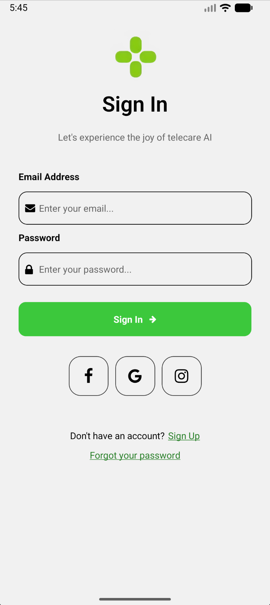
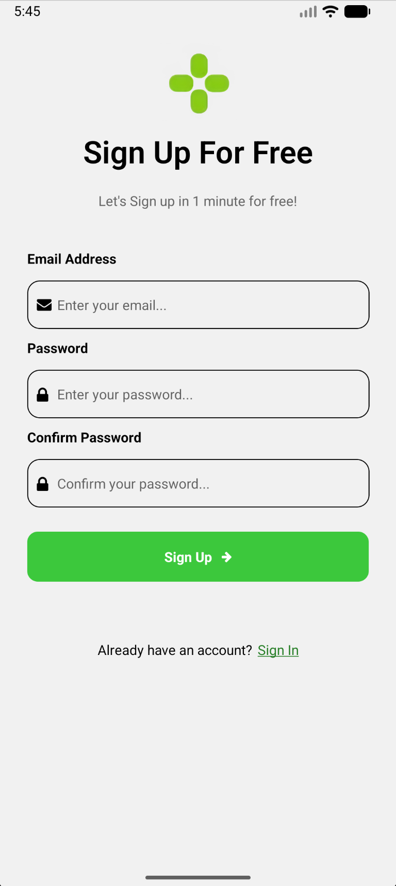
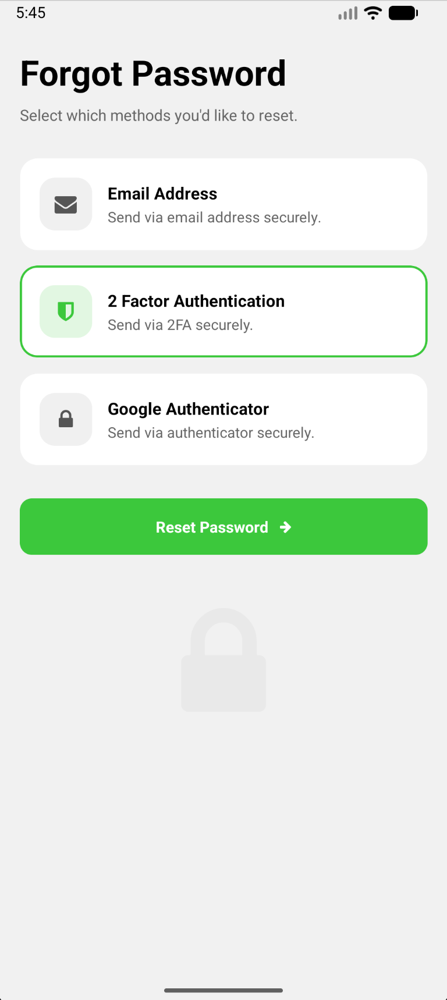

# Dribbble Sign In UI

A React Native (Expo) project replicating a Dribbble authentication UI concept. Featuring Sign In, Sign Up, and Forgot Password screens.

## Screenshots

|                   Sign In                   |                   Sign Up                   |                   Forgot Password                   |
| :-----------------------------------------: | :-----------------------------------------: | :-------------------------------------------------: |
|  |  |  |

## Tech Stack

- Expo SDK 54
- React Native 0.81 / React 19
- TypeScript
- `@expo/vector-icons` for social icons

## Project Structure

```text
app/          # Expo Router screens
components/   # Shared UI components
assets/       # Fonts, images, and screenshots
```
